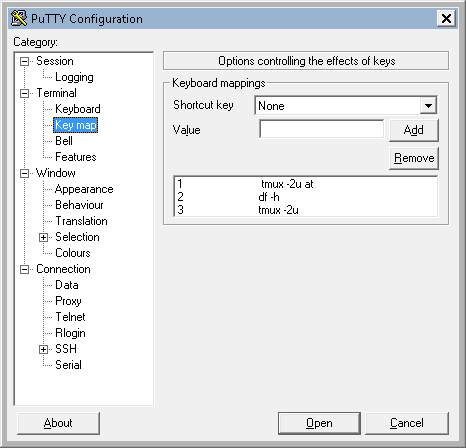

# PuTTY
PuTTY with key mapping feature, you can map commands to a keystroke on a per session.

### Official [readme](README)

###  Customization
  - Configure key mapping (Terminal panel -> Key map)
  - Set Keyboard shortcut Alt + Shift + (Function Key)
  - Add command 

### Screenshots
  
**Keymapping**
